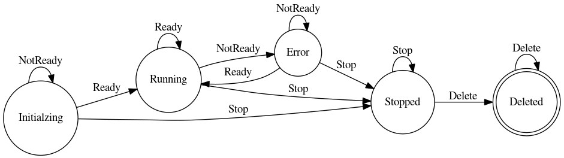

# Horizontally Scalable Finite State Machine

## The Problem

Finite state machine (FSM) is a very classical mathematical model of computation, being widely used in many different situations, including the server back-end. It's reasonable to use FSM at the back-end due to its simplicity and readability, which lead to its maintainability.

However, there is one obvious problem. Usually the finite state machine is structurally simple, so the logic is handled in-memory by a single node. This is the very basic problem of a vallina FSM:

    FSM, as an in-memory model, requires extra efforts when being horizontally scaled.
  
Here, horizontal scaling refers to increasing the capacity by adding more servers/nodes, rather than replacing the servers/nodes with more powerful ones, which is called vertically scaling.

## Solutions and the Idea

Obviously, we can address this problem in many ways. We can sperate the "get" and "set" operations of the FSM, and select just one leader from the candidate servers to perform the "set" operations. Or, we can use specific rules to coordinate the servers before any of them setting the FSM states ...

Since MySQL is often used together with back-end servers, an idea occurs to me that we can simply store and update the states in one place, that is the MySQL database. Problem solved.

## An Example

### A Finite State Machine



|              |   NotReady   |  Ready  |  Stop   | Delete  |
|:------------:|:------------:|:-------:|:-------:|:-------:|
| Initializing | Initializing | Running | Stopped |    -    |
|   Running    |    Error     | Running | Stopped |    -    |
|    Error     |    Error     | Running | Stopped |    -    |
|   Stopped    |      -       |    -    | Stopped | Deleted |
|   Deleted    |      -       |    -    |    -    | Deleted |

### Update the States in MySQL

From the example provided in the directory `examples/mysql`, we can easily get the MySQL statement template for updating FSM states:

```sql
UPDATE {table} SET {field}
    CASE
        WHEN {field} = '{src}' THEN '{dst}'
        # ... multiple cases
        ELSE {field}
    END
WHERE id = '{id}';
```

This is exactly where this package `go-mysql-fsm/fsm` comes from. By generating MySQL statements from the template for FSM events and executing them, we are able to update the FSM states on the MySQL side, other than the server side, so that we avoid the in-memory problem.

This is what implemented in `go-mysql-fsm/fsm`. A user friendly interface is provided to show the usage of this idea as well.
